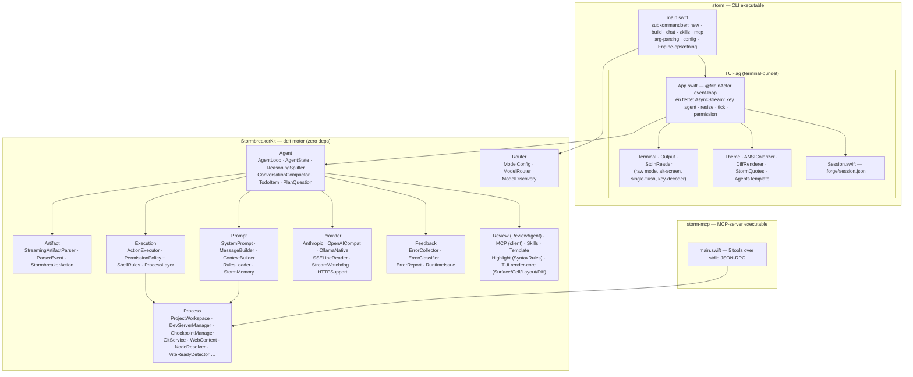
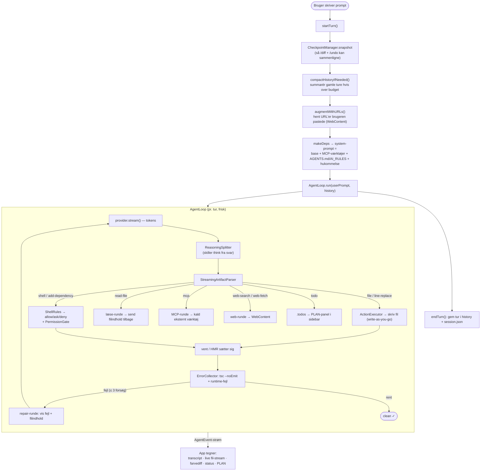
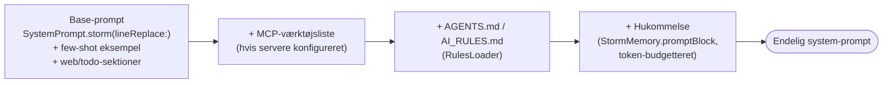
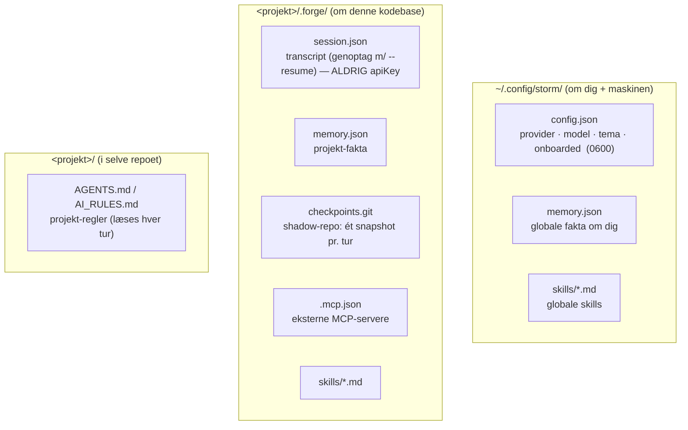

# Stormbreaker CLI (`storm`) — Arkitektur

> Udførlig beskrivelse af alt der er bygget til terminal-versionen af Stormbreaker: hvad delene er, hvordan de hænger sammen, og hvordan en byggeopgave flyder gennem systemet. Mac-appen deler den samme motor (`StormbreakerKit`) men er ikke emnet her.

---

## 1. Hvad er `storm`?

`storm` er en **fuld-skærms terminal-version** af Stormbreaker — en lokal-først, gratis "vibecoding"-agent der bygger og redigerer web-apps (React/Svelte/Vue/Next + Vite + Tailwind). Du beskriver hvad du vil have; agenten skriver filerne, installerer afhængigheder, starter dev-serveren, læser fejlene og retter sig selv — mens du følger med live i terminalen.

To designprincipper styrer det hele:

1. **Zero dependencies.** Hele TUI'en er håndbygget oven på `termios` + ANSI — ingen ncurses, ingen tredjeparts-TUI-bibliotek. Motoren (`StormbreakerKit`) har heller ingen eksterne afhængigheder.
2. **Én motor, to overflader.** Præcis samme `StormbreakerKit` driver både Mac-appen og CLI'en, så adfærd er identisk. Kun præsentationslaget er forskelligt.

---

## 2. Targets (Swift Package)

```
StormbreakerKit/
├── Sources/
│   ├── StormbreakerKit/   → library  (den delte motor, zero-dep)
│   ├── storm/             → executable  (CLI'en + den fuld-skærms TUI)
│   └── storm-mcp/         → executable  (MCP-server: lad eksterne agenter styre Stormbreaker)
└── Tests/StormbreakerKitTests/   → 224 tests
```

| Target | Type | Rolle |
|--------|------|-------|
| **`StormbreakerKit`** | library | Al logik: agent-loop, parser, providers, proces-styring, hukommelse, prompt-bygning, render-primitiver. Delt med Mac-appen. |
| **`storm`** | executable | Terminal-klienten. Arg-parsing + subkommandoer + den `@MainActor` TUI der tegner alt. |
| **`storm-mcp`** | executable | En MCP-server der eksponerer 5 værktøjer (`list_files`, `read_file`, `write_file`, `run_command`, `get_errors`), så Claude Code / Cline / andre agenter kan drive et Stormbreaker-projekt. |

---

## 3. Lagdelt arkitektur (oversigt)



**Læs den oppefra:** `main.swift` tager argumenter, bygger en `Engine` og starter enten TUI'en (`App.swift`) eller den simple linje-REPL. TUI'en consumer én flettet hændelses­strøm og tegner alt. Når en tur kører, driver `AgentLoop` (i motoren) modellen, parseren, eksekveringen og fejl-loopet. Alt under `StormbreakerKit` er ren logik uden terminal-afhængigheder, så det kan unit-testes og genbruges af Mac-appen.

---

## 4. `Engine` — det der wires sammen pr. projekt

`main.swift` samler en `Engine` (struct) som holder de levende komponenter for ét projekt:

```swift
struct Engine: Sendable {
    let workspace:   ProjectWorkspace   // filer i projektet (læs/skriv/fil-map)
    let devServer:   DevServerManager   // Vite dev-server + log-tailing + tsc
    let collector:   ErrorCollector     // samler build/runtime-fejl pr. tur
    var config:      ModelConfig        // var → /model kan skifte model midt i en session
    let mcp:         MCPManager         // klient til eksterne MCP-værktøjer
    let checkpoints: CheckpointManager  // shadow-git: snapshot pr. tur → /diff /undo /restore
}
```

Hver tur bygges en frisk `AgentLoop.Dependencies` af `makeDeps(engine:…)`, som bl.a. samler **system-prompten** (se §7) og kobler proces-laget, fejl-samleren, MCP-kald og web-værktøjet på.

---

## 5. En byggeopgave — data-flow

Det her sker når du skriver en besked og trykker Enter (i `App.startTurn` → `AgentLoop.run`):



**Nøglepunkter:**

- **Tool-runder er ikke repairs.** Læse-, MCP- og web-runder fodrer resultater tilbage og fortsætter uden at tælle som et fejl-forsøg. Repair-loopet er kun for ægte build/runtime-fejl og er begrænset til 3 forsøg med en "ingen-fremgang"-vagt.
- **Write-as-you-go.** Filer skrives så snart deres luk-tag ankommer i strømmen — derfor kan du se koden blive skrevet live.
- **Én strøm, én tegner.** Loopet udsender `AgentEvent`s; `App` oversætter dem til skærm-opdateringer. Stop = annullér tur-`Task`'en.

---

## 6. Undersystemer i `StormbreakerKit`

| Mappe | Ansvar | Centrale typer |
|-------|--------|----------------|
| **Agent** | Selve agent-loopet + tilstand | `AgentLoop` (build/plan), `AgentState`, `AgentEvent`, `ReasoningSplitter` (skiller `<think>`), `ConversationCompactor`, `TodoItem`, `PlanQuestion` |
| **Artifact** | Tolker modellens streamede output | `StreamingArtifactParser` (inkrementel, chunk-robust), `ParserEvent`, `StormbreakerAction` (`file`/`lineReplace`/`shell`/`start`/`addDependency`) |
| **Execution** | Udfører handlinger + tilladelser | `ActionExecutor`, `PermissionPolicy` + **`ShellRules`** (per-kommando triage), `ProcessLayer` (protokol) |
| **Prompt** | Bygger det modellen ser | `SystemPrompt`, `MessageBuilder`, `ContextBuilder` (fil-budget), `RulesLoader` (AGENTS.md), **`StormMemory`** (cross-session) |
| **Provider** | Taler med modellerne | `AnthropicProvider`, `OpenAICompatProvider`, `OllamaNativeProvider`, `SSELineReader`, `StreamWatchdog` |
| **Router** | Vælger model + indstillinger | `ModelConfig` (7 providers + priser), `ModelRouter`, `ModelDiscovery` (auto-find Ollama/LM Studio) |
| **Process** | Alt der rører OS/filer/netværk | `ProjectWorkspace`, `DevServerManager`, `CheckpointManager` (shadow-git), `GitService`, **`WebContent`** (URL-hent + DuckDuckGo-søg), `NodeResolver`, `ViteReadyDetector`, `ProcessSupervisor` |
| **Feedback** | Selv-korrektion | `ErrorCollector`, `ErrorClassifier`, `ErrorReport`, `RuntimeIssue` |
| **MCP** | Klient til eksterne værktøjer | `MCPManager`, `MCPClient` (stdio JSON-RPC) |
| **Review** | Multi-agent gennemgang | `ReviewAgent` (4 parallelle linser: korrekthed/sikkerhed/frontend/backend) |
| **Skills** | Bruger-definerede presets | `Skill`, `SkillStore` (markdown i `~/.config/storm/skills` + `.forge/skills`) |
| **Template** | Projekt-skabeloner | `TemplateInstaller`, React/Svelte/Vue/Next `…Template`, `Framework` |
| **Highlight** | Syntaks-regler (delt m/ app) | `SyntaxRules` |
| **TUI** | Rene render-primitiver (CI-testbare) | `Surface` (ScreenBuffer), `Cell`, `Layout`, `Diff`, `TextWidth`, `Geometry`, `Input` |

---

## 7. System-prompten — sådan lægges den i lag

For hver tur bygger `makeDeps` prompten oppefra (`main.swift`):



Stærke (cloud-)modeller får line-replace-formatet (målrettede diffs); svagere lokale modeller bliver på hele-fil-skrivning. Plan-mode bruger en separat prompt der forbyder kode.

---

## 8. Persistens — hvad gemmes hvor



API-nøgler gemmes **aldrig** i session/config — de genskabes fra config/env/`--api-key` ved opstart.

---

## 9. Det der blev bygget (de seneste funktioner)

| Funktion | Hvor | Hvad |
|----------|------|------|
| **Per-kommando shell-tilladelser** | `Execution/PermissionPolicy.swift` (`ShellRules`) | Sikre kommandoer kører uden prompt, katastrofale (`rm -rf /`, `sudo`, `curl\|sh`) afvises, resten spørger. Kæder splittes; mest restriktive vinder. |
| **Web som agent-værktøj** | `Process/WebContent.swift`, `Artifact`, `Agent` | Modellen kan `web-search` (DuckDuckGo lite, ingen nøgle) og `web-fetch` (URL/GitHub-README) midt i en build; resultat fodres tilbage som utroværdig reference. |
| **Live todo-checklist** | `Agent/TodoItem.swift`, `App.swift` (`renderPlan`) | `<forgeAction type="todo">` → et `Plan n/m`-panel øverst i sidebjælken (✓/spinner/○), synligt mens koden streames. Fallback: fanger markdown-tjeklister i prosa. |
| **Samtale-compaction** | `Agent/ConversationCompactor.swift`, `/compact` | Summerer ældste ture når historikken overstiger budgettet, så små lokale kontekstvinduer ikke løber over. Fejl → behold alt. |
| **Cross-session hukommelse** | `Prompt/StormMemory.swift`, `/remember`, `/memory` | Husker dig + projektet mellem sessioner (global + projekt JSON), injiceres i prompten. `/remember` uden tekst lader modellen udtrække holdbare fakta. Lånt fra iai-pme — reimplementeret native uden vektor-DB/daemon. |

---

## 10. Slash-kommandoer (i TUI'en)

| Kommando | Handling |
|----------|----------|
| `/diff [n]` | Vis ændringer fra tur *n* (farvediff) |
| `/model` | Skift AI-model (auto-find lokale + cloud-providers) |
| `/undo` · `/restore [n]` · `/checkpoints` | Rul filer tilbage til før en tur |
| `/review` · `/fix` | 4 parallelle gennemgangs-agenter · ret deres fund |
| `/compact` | Komprimér samtalehistorik nu |
| `/remember [tekst]` · `/memory` | Husk en fakta / lær af sessionen · vis + glem hukommelse |
| `/theme` · `/init` | Skift farvetema · skriv `AGENTS.md` |
| `/github` · `/commit` · `/push` · `/pull` · `/pr` | Git/GitHub-arbejdsgang via `gh` |
| `/kø <opgave>` | Stil byggeopgaver i kø (kører én ad gangen) |
| `/copy` · `/help` · `/quit` | Kopiér sidste svar · hjælp · afslut |

---

## 11. Byg, kør, test

```bash
# Byg CLI'en
DEVELOPER_DIR=/Applications/Xcode.app swift build --product storm

# Kør (fuld-skærms TUI er default på en interaktiv terminal)
storm chat --project ./min-app
storm new min-app --framework react
storm build "lav en tæller-app"      # one-shot
storm --no-tui / --plain             # ikke-interaktiv linje-output (CI/scripting)

# Tests (224, hele motoren)
DEVELOPER_DIR=/Applications/Xcode.app swift test --scratch-path .build-xcode
```

Installer den prebyggede binær: `curl -fsSL https://parthee-vijaya.github.io/stormbreaker-mac/install.sh | sh`

---

## 12. Designvalg værd at kende

- **Hånd­bygget TUI, zero deps.** `Terminal` ejer raw-mode/alt-screen via `termios`; render­kernen komponerer en hel ramme i én `ScreenBuffer`, row-differ mod forrige ramme og skriver **én `write(2)` pr. frame** (flicker-fri, ≤60fps).
- **Swift 6 strict concurrency.** `App` er `@MainActor`; baggrunds-callbacks (SIGWINCH, stdin-læsning, model-streams) er eksplicit `@Sendable` for at undgå actor-isolation-traps.
- **Ikke-blokerende tilladelser.** `TUIPermissionGate` suspenderer på en `continuation` der løses på et tastetryk — render-loopet bliver ved med at animere.
- **CI/scripting-sikkert.** TUI'en tænder kun på en interaktiv TTY; `--plain`/`--no-tui` giver byte-identisk linje-output.
- **forge-cross røres aldrig** — den cross-platform Tauri-variant er et separat spor.
```
